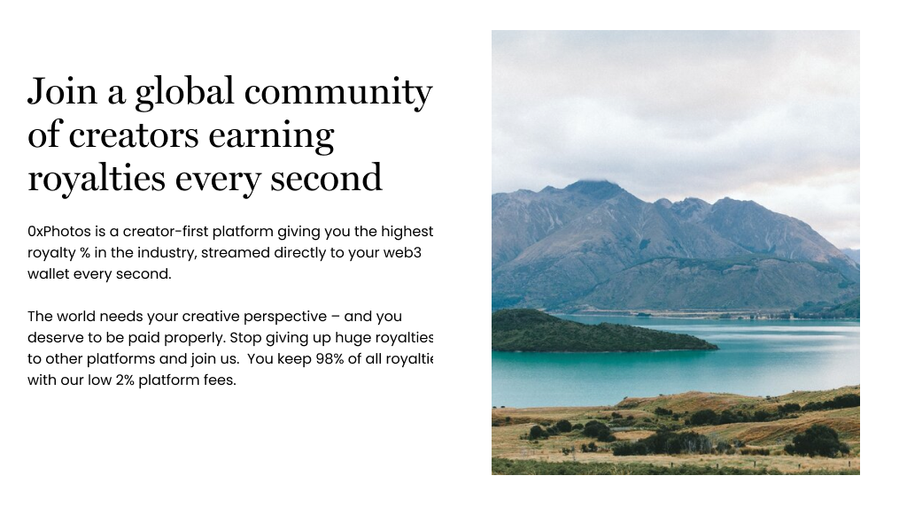

# 0xPhotos

0xPhotos.com is a two sided marketplace that replaces the need for incumbent stock photo sites and their exorbitant fees.

## Problem:

Photo marketplaces take massive % of a photos sale:

- stock.adobe.com: 40-80%
- shutterstock.com: 70-80%
- alamy.com: 50%

Creators should be earning the majority of the sale, not the other way around.

## Our solution

Photographers upload an image and mint an “Asset NFT”. Media buyers mint a “Licence NFT” to define usage and enable payments.

Payments automatically stream to the Asset NFT creating cash flow for the photographer. 0xPhotos is streamed 2% of all payments through the system to fund the intended DAO and future development.

Asset NFTs become future cash flow positive assets that can be traded on NFT marketplaces.

## How It's Made

Architecture:

- NFT 721 asset contract
- NFT 721 license contract
- Superfluid Tradeable Cashflow contract
- React-based NFT website + marketplace

Technologies

- Polygon: All contracts and NFTs (minting + marketplace) are on Polygon instead of L1.
- IPFS: We store all assets and licenses on IPFS.
- Moralis: Moralis is our API for interacting with the blockchain.
- Superfluid: Anyone who licenses content opens a SuperFluid stream paying the NFT's owner.
- Covalent: NFT indexing and metadata.
- Next.js for frontend
- Truffle and Remix for Solidity development
